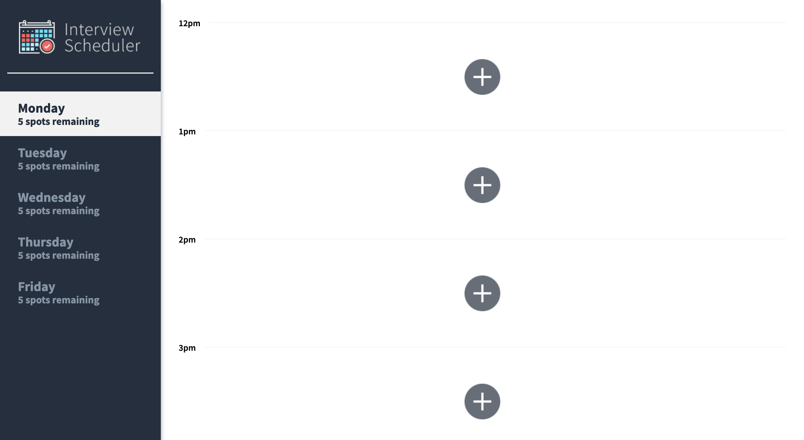
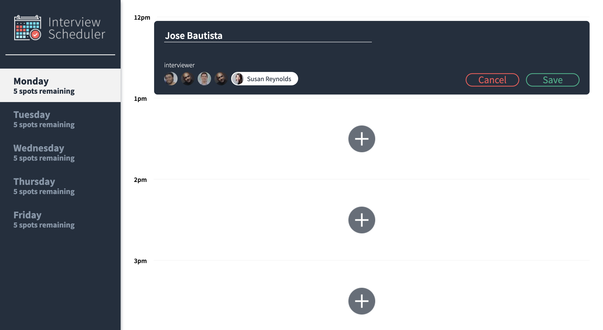
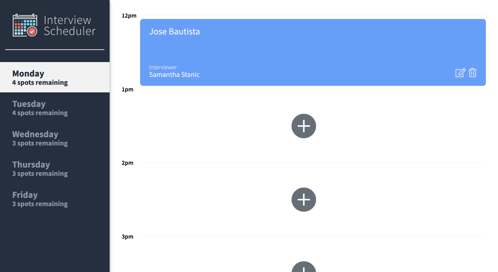
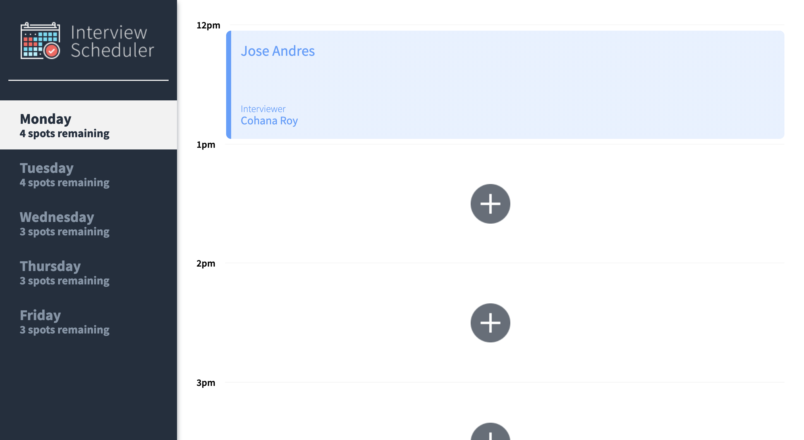
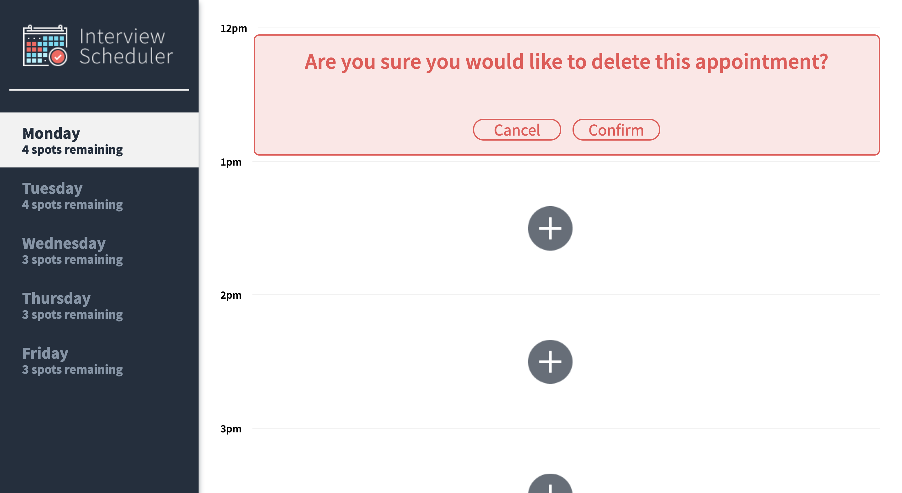

# Interview Scheduler
This App let's you see the appointments that are available for that certain day and let's you create, edit and delete an appointment. 

Take a look at the app [Interview Scheduler](https://schedule-for-interviews.netlify.app/) where [Netlify](https://app.netlify.com/) works as client. I used [CircleCI](https://circleci.com/) for automatic continuous integration and tests and hosted the app on [Heroku](https://www.heroku.com).

## Visual of the project
### Home Page 

### New Appointment


### Saved Appointment


### Edit Appointment


### Delete Appointment

## Setup

Install dependencies with `npm install`.

## Running Webpack Development Server

```sh
npm start
```

## Running Jest Test Framework

```sh
npm test
```

## Running Storybook Visual Testbed

```sh
npm run storybook
```
## Dependencies
* @babel/core
* @storybook/addon-actions
* @storybook/addon-backgrounds
* @storybook/addon-links
* @storybook/addons
* @storybook/react
* @testing-library/jest-dom
* @testing-library/react
* @testing-library/react-hooks
* babel-loader
* node-sass
* prop-types
* react-test-renderer